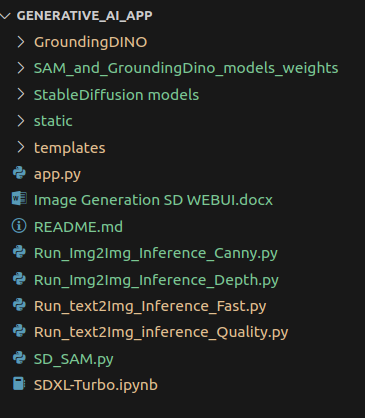

<!-- markdownlint-configure-file {
  "MD013": {
    "code_blocks": false,
    "tables": false
  },
  "MD033": false,
  "MD041": false
} -->

<div align="center">

<sup>All Rights are Reserved</sup>

<a href="https://www.linkedin.com/in/basim-bashir-035403214/">
  <div>
    
  </div>
  <b>
    At OuterAspect IP Ltd, we build the future of media through artificial intelligence. By leveraging computer vision, machine learning and advanced analytics in our suite of products, we are reinventing content generation, image editing, statistics and more - making the creation and consumption of content better, faster, and more immersive. The apps we create save editors 60% of time while delivering insights impossible before. As pioneers at the intersection of media and AI, the future is ours to shape.
  </b>
  <div>
   <br>
    <sup>Visit <u>OuterAspect IP Ltd</u> to learn more.</sup>
  </div>
</a>

<hr />

# AI Image Generator

At OuterAspect IP Ltd, we're committed to leveraging **cutting-edge AI** and **computer vision technology** to revolutionize the content and media industry. 

This app demonstrates the immense potential of AI to accelerate and enhance Image content creation, unlocking efficiencies we never thought possible. We're thrilled by the **60%** faster Image Generation delivered by this innovative solution, allowing us to better serve both creators and consumers of content around the globe. <br />
**The future is bright!**

[Getting started](#getting-started) •
[Installation](#installation)


</div>

## Getting started

[![Watch the video][tutorial]](https://www.youtube.com/watch?v=lV34Flylh6Y)

[tutorial]: https://www.youtube.com/watch?v=lV34Flylh6Y
## Installation

AI Image Generator runs on most major platforms. If your platform isn't listed, please [open an issue][issues]. This App needs **cuda 12.2** to run the app with minimal modification if you have a cuda version other than this then make sure to first Install [cuda](https://techzizou.com/install-cuda-and-cudnn-on-windows-and-linux/)  and [Anaconda](https://docs.anaconda.com/free/anaconda/install/linux/) on your PC. You just need this step if your have another cuda version installed in your system, and you do not want to upgrade or downgrade to specified version. AI Image Generator can be installed in these steps:

1. **Installation on Ubuntu**

    <br>
    <summary style="color: #1E90FF">Installation Setup by directly Running App through Anaconda <b> Base</b>  environment</summary>
    <br>=====> To use the AI Image Generator, we suggest using Anaconda. <=====<br><br>
    
    <details>
    <summary style="color: #87CEFA">cuda setup</summary>
      
      1. Verify your system's CUDA version with the following command:
          ```sh
          nvcc -V
          ```
      2. Ensure your CUDA version is 12.2, as these versions are tested compatible.
      
      3. Setup your system to be CUDA enabled. Open a terminal and update your system with these commands.Firstly, run the following commands to update and upgrade all the packages on your Ubuntu.   
          ```sh
          sudo apt-get update
          sudo apt-get upgrade
          ```
      4. Next, install all the necessary dependencies
         ```sh
         sudo apt-get install build-essential cmake unzip pkg-config
         sudo apt-get install gcc-9 g++-9 
         sudo apt-get install libxmu-dev libxi-dev libglu1-mesa libglu1-mesa-dev
         sudo apt-get install libjpeg-dev libpng-dev libtiff-dev
         sudo apt-get install libavcodec-dev libavformat-dev libswscale-dev libv4l-dev
         sudo apt-get install libxvidcore-dev libx264-dev
         sudo apt-get install libopenblas-dev libatlas-base-dev liblapack-dev gfortran
         sudo apt-get install libhdf5-serial-dev
         sudo apt-get install python3-dev python3-tk python-imaging-tk
         sudo apt-get install libgtk-3-dev
         ```
      5. Next, add the ppa:graphics-drivers/ppa repository into your system:
         ```sh
         sudo add-apt-repository ppa:graphics-drivers/ppa
         sudo apt update
          ```
      6. Next, install the Nvidia driver compatible with your CUDA version. For CUDA upto 12.2 the minimum driver version for Linux is >= 535.xx.xx
         ```sh
         sudo apt-get install nvidia-driver-535
         ```
         (You can read about the minimum driver versions required here on the links given below.)
         https://docs.nvidia.com/deploy/cuda-compatibility/index.html <br><br>
   
      7. Next, create a folder and run the commands from the installation instructions for the base installer.
         ```sh
         cd ~
         mkdir installers
         cd installers/
         ```
      8. Find cuda version from this site: https://developer.nvidia.com/cuda-toolkit-archive <br>
         (I downloaded and installed CUDA 12.2. You should use the latest CUDA toolkit and its corresponding cuDNN file. This is just for demonstration.) <br><br>
         Go to [Archive of Previous CUDA Releases][cuda_releases] and click on CUDA Toolkit 12.2.<br><br>
         • On the next page, first, choose your operating system as Linux.<br>
         • Next, choose your Architecture, distribution, and version. For my system, the architecture is x86_64 as I have a 64-bit Ubuntu system, and the version of Ubuntu is 20.04.<br>
         • Next, choose any installer type to download. I have downloaded the runfile (local) type installer.<br>
         • You will then see a few commands in the installation instructions for the base installer.<br><br>
         <br>
   
         ```sh
         wget https://developer.download.nvidia.com/compute/cuda/12.2.2/local_installers/cuda_12.2.2_535.104.05_linux.run
         sudo sh cuda_12.2.2_535.104.05_linux.run
         ```
         <br><br>
         • When the setup starts, accept the EULA agreement, then on the next screen uncheck the Nvidia driver option since we have already installed it manually earlier and finally press Enter to install CUDA. ( You can leave the Driver option checked if you have not manually installed a specific version Nvidia driver above. This installs the driver version 525.xx.xx which comes bundled with the CUDA installer.)<br><br>
         <br><br>
         • You’ll see a summary at the end of CUDA installation as shown below.<br><br>
         <br><br>
      9. Next, open the bashrc script file using the following command.

         ```sh
         nano ~/.bashrc
         ```
      10. Add the following lines at the end of the bashrc file. ( I have **Cuda 12.2**. Change this according to your version)
         
            ```sh
            # NVIDIA CUDA TOOLKIT
            export PATH=/usr/local/cuda-12.2/bin${PATH:+:${PATH}}
            export LD_LIBRARY_PATH=/usr/local/cuda-12.2/lib64${LD_LIBRARY_PATH:+:${LD_LIBRARY_PATH}}
            ```
      11. The bashrc file looks like below:
         <br><br>
      **Press Ctrl + x, y and Enter to save changes**.<br><br>
      12. Next, run the source command to update your current shell environment.
            ```sh
            source ~/.bashrc
            ```
      13. That’s it! We have successfully installed CUDA on our system. Run sudo reboot to restart your system for the new changes to take effect. After ubuntu restarts, you can confirm your CUDA installation by running **nvcc -V** and **nvidia-smi** commands.
         
      14. Download and setup CUDNN<br><br>
      Go to https://developer.nvidia.com/rdp/cudnn-archive to download a specific version of CUDNN that is compatible with your CUDA toolkit.<br><br>
      **NOTE**: You have to be signed in using your Nvidia account to download CUDNN. If you do not have an account, create one.<br><br>
      Since I have setup CUDA 12.2.2, I will download cuDNN v8.9.5 for CUDA 12.x
      15. Click on cuDNN 8.9.5 and select cuDNN Library for Linux (x86_64) 
         <br><br>
      16. Next, it will ask you to log in. Create an Nvidia account or sign in using Google or Facebook. Once logged in you can download the cuDNN file.
      17. Copy the downloaded cuDNN zip file to the **installers** folder.
         <br><br>
      18. Unzip the cuDNN zip file using the following command. You will see a folder named cuda with include and lib sub-folders in it after unzipping this.
            ```sh
            tar -xf cudnn-linux-x86_64-8.9.5.30_cuda12-archive.tar.xz
            ```
          

      19. Next, we have to copy the contents of these sub-folders to the path where we installed CUDA in step 1 above.<br><br>
            **COPY CONTENTS FROM THE CUDA FOLDER UNZIPPED FROM CUDNN TO THE MAIN CUDA DIRECTORY**<br><br>
          - Rename unzipped folder to cudnn.
          
      20. We need the contents of the include & lib folders from cuDNN to be inside the (include and lib64) folders of CUDA directory (where we installed CUDA shown in step 1 above). Run the following commands:
      ```sh
       cd cudnn
       sudo cp -P lib/* /usr/local/cuda/lib64/
       sudo cp -P include/* /usr/local/cuda/include/
      ```
      <br><br>
   
      - That’s it. We have successfully set up CUDA and cuDNN on our Linux Ubuntu 20.04 system.
    <br><br>
    </details>

    <details>
    <summary style="color: #87CEFA">Anaconda Setup</summary>
       <br>=====> Install Anaconda on Ubuntu<=====<br><br>
          
      1. Run the following command to install Prerequisite packages:
         ```sh
         sudo apt-get install libgl1-mesa-glx libegl1-mesa libxrandr2 libxrandr2 libxss1 libxcursor1 libxcomposite1 libasound2 libxi6 libxtst6
         ```
      2. Download Anaconda **sh** file from here [Anaconda/Downloads](https://www.anaconda.com/download).

      3. To install from **sh** file, open a terminal and use the following command, depending on your Linux architecture:
         ```sh
            # Replace <INSTALLER_VERSION> with the version of the installer file you downloaded
            # For example, Anaconda3-2023.09-0-Linux-x86_64.sh
            # All installers can be found at https://www.anaconda.com/download

            bash Anaconda3-<INSTALLER_VERSION>-Linux-x86_64.sh
         ```

      4. Press Enter to review the license agreement. Then press and hold Enter to scroll.

      5. Enter **yes** to agree to the license agreement.

      6. Use Enter to accept the default install location, use CTRL+C to cancel the installation, or enter another file path to specify an alternate installation directory. If you accept the default install location, the installer displays **PREFIX=/home/<USER>/anaconda3** and continues the installation. It may take a few minutes to complete.

      7. Anaconda recommends you enter “**yes**” to initialize Anaconda Distribution by running conda init. If you enter “**no**”, then conda will not modify your shell scripts at all. In order to initialize conda after the installation process is done, run the following commands:
          
         ```sh
         # Replace <PATH_TO_CONDA> with the path to your conda install
         
         source <PATH_TO_CONDA>/bin/activate
         conda init
         ```

      8. The installer finishes and displays, “Thank you for installing Anaconda3!”

      9. Close and re-open your terminal window for the installation to take effect, or enter the command ```source ~/.bashrc``` to refresh the terminal.

      10. You can also control whether or not your shell has the base environment activated each time it opens.

          ```sh
          # The base environment is activated by default
          conda config --set auto_activate_base True
    
          # The base environment is not activated by default
          conda config --set auto_activate_base False
    
          # The above commands only work if conda init has been run first
          # conda init is available in conda versions 4.6.12 and later
          ```
   
      11. [Verify your installation](https://docs.anaconda.com/free/anaconda/install/verify-install/).

      <br>=====> Now, Anaconda is installed on your system <=====
      <br><br>
    </details>

    <details>
    <summary style="color: #87CEFA">How to Run App</summary>
        <br>=====> Run App in your localhost <=====<br><br>
    
   1. First open your terminal and paste this command:
       ```sh
       conda activate
       ```

      - You will see **Base** written on left side of your cli. It means your anaconda base environment is now activated!
      - This app is tested on ubuntu 20.04, cuda version (12.2), from (12GB vram of RTX 3060) to (24GB vram of RTX 3090), from (32GB system Ram) to (64GB system Ram), 128GB+ SSD storage.

      2. Install PyTorch on your **base** environment:
         ```sh
         conda install pytorch==2.1.2 torchvision==0.16.2 torchaudio==2.1.2 pytorch-cuda=12.1 -c pytorch -c nvidia
         ```
      3. Now, install these Packages in your conda **base** environment:
         ```sh
         pip3 install -U diffusers transformers accelerate controlnet_aux opencv-contrib-python scipy segment_anything flask
         ```
      4. Now clone my Repo in your desired location using git clone.

      5. Now, cd to the cloned project is located using **base** env for example; ``` cd Generative_AI_APP ```

      6. Now run these commands in your **base** env:
         ```sh
         # clone GroundingDino project inside the root directory of Generative_AI_APP
         git clone https://github.com/IDEA-Research/GroundingDINO.git

         # go inside the project
         cd GroundingDINO

         # Install this project using given command in order to use it as a python package
         pip install -e .

         # Back to Project's root working directory
         cd ..
         ```
      7. If ```pip install -e .``` raised any error or **GroundingDino** package is not properly installed then follow this method in your **base** env:
         ```sh
         # clone GroundingDino project inside the root directory of Generative_AI_APP
         git clone https://github.com/IDEA-Research/GroundingDINO.git

         # Install this project using given command in order to use it as a python package
         python -m pip install -e GroundingDINO
         ```
      8. Now, follow these steps:

         - Go to this path: **GroundingDINO/groundingdino/util**

         - Now open **inference.py** in your ide GUI

         - Navigate to **load_image** method / function inside **inference.py**

         - Rename **load_image** to **load_image_dino**

      8. If everything went fine now you can run the app by putting this commad in your conda's **base** environment activated terminal.
         ```sh
         python app.py
         ```
      9. Note: If you encounter any kind errors like could not find '**load_model**' inside given path in app.py then just follow the path inside GroundingDino project and see if it is present inside 'groundingdino/util/inference' see a method load_model. So, just replace this line ```from groundingdino.util.inference import load_model, load_image, predict, annotate``` with this ```from GroundingDino.groundingdino.util.inference import load_model, load_image, predict, annotate``` in your app.py and SD_SAM.py.

      10. Note: i will not be sharing Stable Diffusion model weights in my Repo because of storage issues (model takes upto 100GB storage which obviously github and gitlab does not support). So, all model weights will be downloaded automatically once you load the img2img.html ND text2img.html pages. You would see models being downloaded automatically in your terminal.

      11. Project's File Structure should look like this:
            <div>
               
            </div>

      12. If you find any issue in Project. You can contact me Links are Below.  Enjoy!!!!!
   
      <br><br>
   </details>

<!-- Contributors -->
## Developer

   <h3><b>Basim Bashir</b></h3>
   <br>
   
   [](https://www.linkedin.com/in/basim-bashir-035403214?utm_source=share&utm_campaign=share_via&utm_content=profile&utm_medium=android_app) 

   [](https://mail.google.com/mail/?view=cm&fs=1&to=basim.bashir0968@gmail.com) 


[cuda_releases]: https://developer.nvidia.com/cuda-toolkit-archive
[issues]: https://github.com/zfsportsanalytics/cricket-analytics/issues/new
[tutorial]: https://www.youtube.com/watch?v=lV34Flylh6Y
